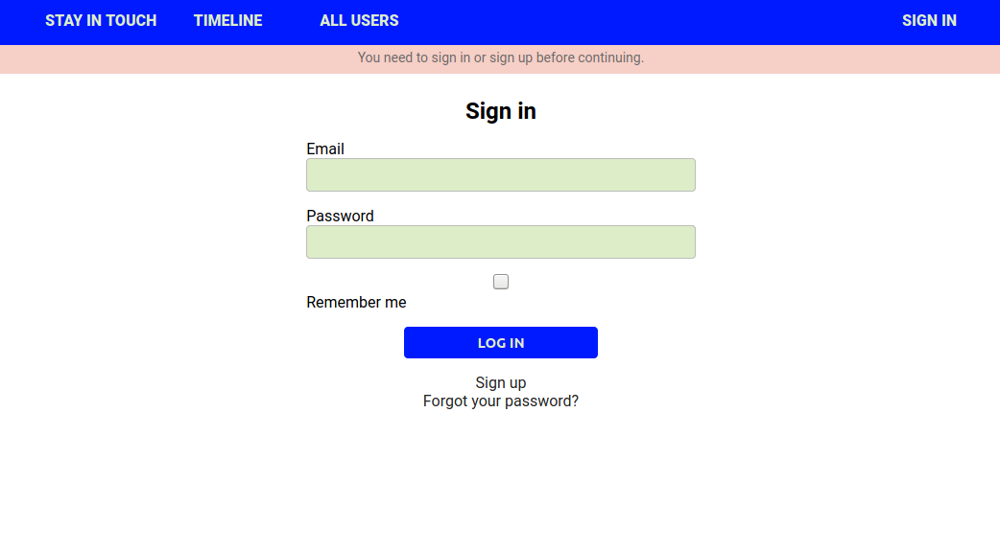

# Scaffold for social media app with Ruby on Rails

> This repo includes intial code for social media app with basic styling. Its purpose is to be a starting point for Microverse students.



## Built With

- Ruby v2.7.0
- Ruby on Rails v5.2.4

## Live Demo

[Live demo](https://ror-social-media-project.herokuapp.com/)

## Getting Started

To get a local copy up and running follow these simple example steps.

### Prerequisites

Ruby: 2.6.3
Rails: 5.2.3
Postgres: >=9.5

### Setup

Install gems with:

```
bundle install
```

Setup database with:

```
   rails db:create
   rails db:migrate
```

To install RSpec open terminal and enter the following

```
gem install rspec
```

To check the version of RSpec that was installed

```
rspec --version
```

Take a minute and look through the various options available in rspec

```
rspec --help
```

In your terminal enter:

```
cd ~
git clone https://github.com/mcervantes71/Members_Only/tree/develop
cd Members_Only/
rails s
```

if presented with and `Error` message similar to this:


Run:
`yarn install --check-files`

### Usage

Start server with:

```
    rails server
```

Open `http://localhost:3000/` in your browser.

### Run tests

```
    rpsec --format documentation
```

> Tests will be added by Microverse students. There are no tests for initial features in order to make sure that students write all tests from scratch.

## Authors

👤 **Martin Cervantes**

- Linkedin: [Martin Cervantes](https://www.linkedin.com/in/cervantesmartin/)
- Twitter: [@M4rt1nC3rv4nt3s](https://twitter.com/M4rt1nC3rv4nt3s)
- Github: [@mcervantes71](https://github.com/mcervantes71)
- Gmail: [cervantes.martine](mailto:cervantes.martine@gmail.com)

👤 **Aulbourn Knowles**

- Linkedin: [Aulbourn Knowles](https://www.linkedin.com/in/aulbourn-knowles)
- Twitter: [@aulbytj](https://twitter.com/aulbytj)
- Github: [@aulbytj](https://github.com/aulbytj)
- Gmail: [aulbourn](mailto:aulbourn@gmail.com)

## 🤝 Contributing

Contributions, issues and feature requests are welcome!

Feel free to check the [issues page](https://github.com/mcervantes71/ror-social-scaffold/issues).

## Show your support

Give a ⭐️ if you like this project!

## Acknowledgments

TBA

## 📝 License

This project is [MIT](lic.url) licensed.
